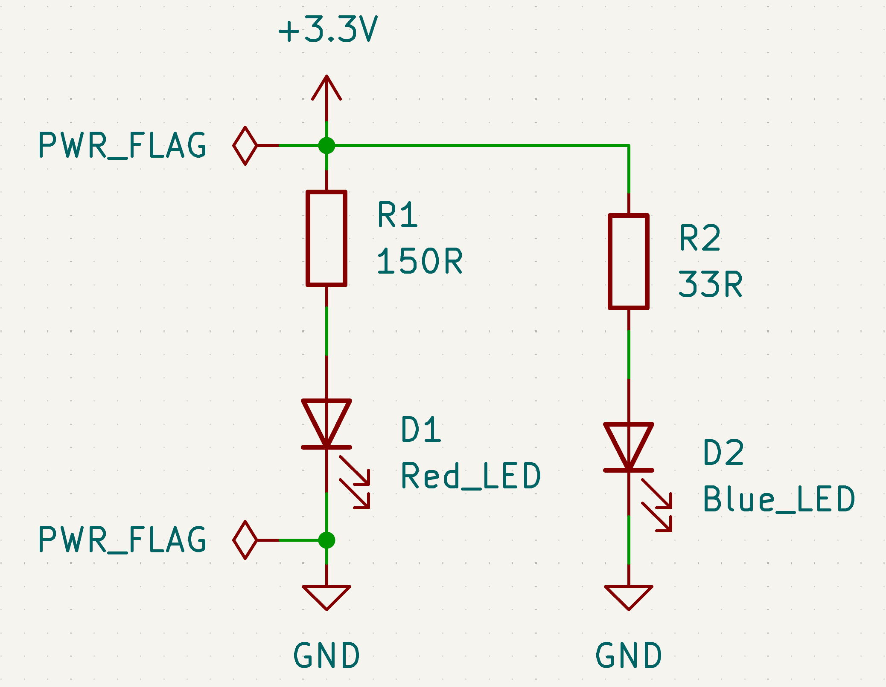
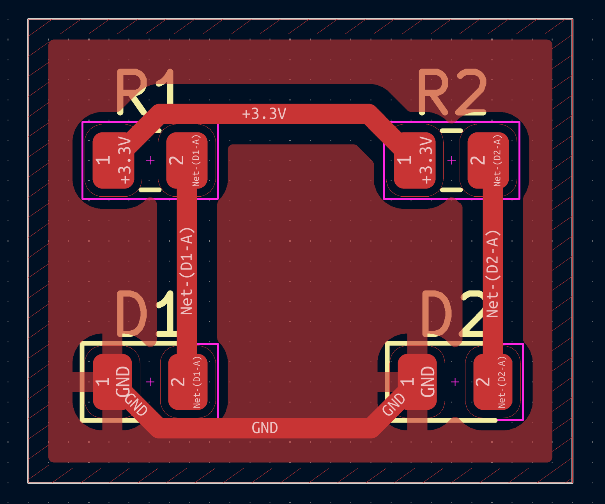

# LED Blink Circuit

A current-limited LED driver circuit with two parallel branches, each sized for a
different LED forward voltage.

## Schematic

## PCB Layout

## Design notes

Two LEDs (red and blue) run in parallel off a shared 3.3V rail, each with its
own series resistor sized using Ohm's law against the LED's actual forward
voltage rather than a single generic value:

- **Red LED branch:** R = (3.3V − 2.0V) / 10mA → 150Ω
- **Blue LED branch:** R = (3.3V − 3.0V) / 10mA → 33Ω

Sizing each resistor individually avoids under-driving or over-driving either
LED — a flat "one resistor fits all" value would have left one of the two
either too dim or running outside its rated current.

## Layout

- Two-layer board with a ground plane poured on the front copper layer
- 45° trace routing throughout, no 90° corners
- Components placed with current-flow order preserved (resistor → LED → GND,
  top to bottom) for easy visual tracing of the circuit
- Routing favors a clean, traceable rectangular path (+3.3V across the top,
  GND across the bottom) over the shortest possible trace length. At this
  circuit's current draw (~10mA per branch), the added trace length has no
  meaningful electrical impact, so legibility was the deciding factor. A
  tighter, shorter-trace layout would be the better choice if this board were
  being optimized for production at volume

## Manufacturing

- 2-layer, standard FR4
- Passed DRC with 0 violations
- Gerbers generated and verified in a Gerber viewer prior to export
