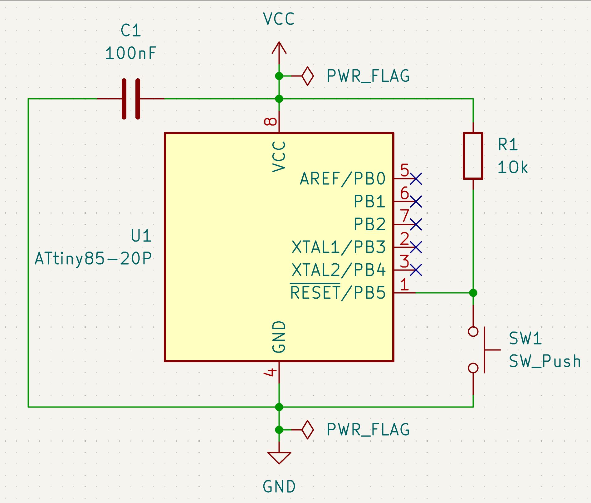
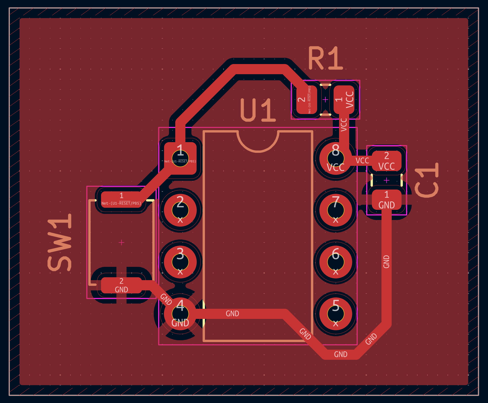

# ATtiny85 Microcontroller Board

A minimal ATtiny85 breakout with a proper reset circuit, power decoupling, and
a ground plane poured on a 2-layer board.

## Schematic

## PCB Layout

## Design notes

The board follows the standard MCU support pattern used across virtually
every microcontroller design:

- **Decoupling:** a 100nF ceramic capacitor sits directly on VCC/GND, placed
  within 2mm of the chip's power pin to suppress switching noise from the
  digital logic
- **Reset:** a 10kΩ pull-up holds RESET high during normal operation; a
  momentary push button pulls it low for a manual reset. Without the pull-up,
  RESET would float and the chip could reset unpredictably from noise
- **Unused I/O:** all unused GPIO pins are explicitly marked no-connect at the
  schematic level, so anyone reviewing the design knows they were left
  unconnected on purpose, not by oversight

## Manufacturing

- Through-hole DIP-8 package for easy hand assembly and prototyping
- 2-layer board with a ground plane poured on the front copper layer
- Passed DRC with 0 violations, 0 unconnected nets
- Ground plane poured with solid connection on small-pad components
