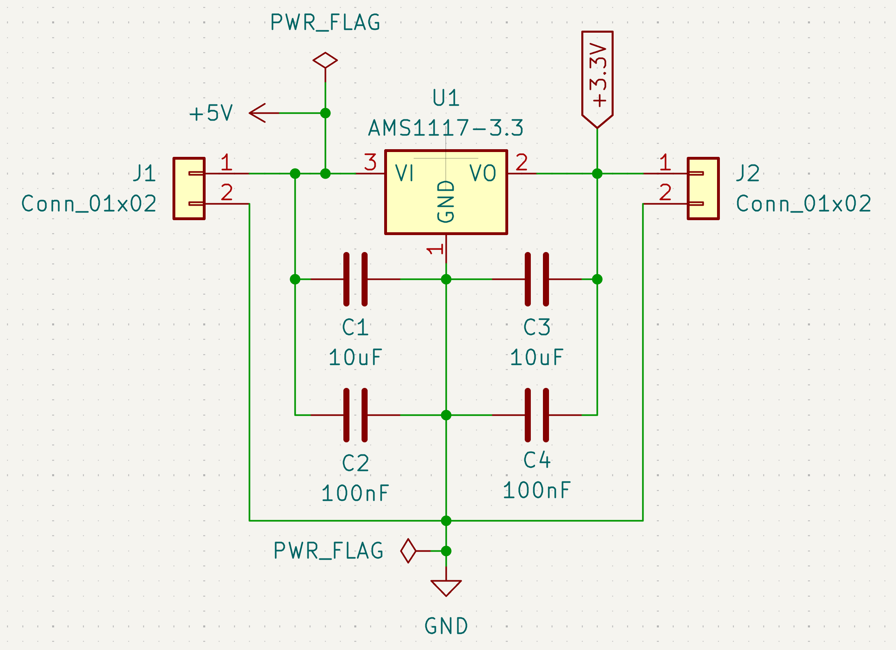
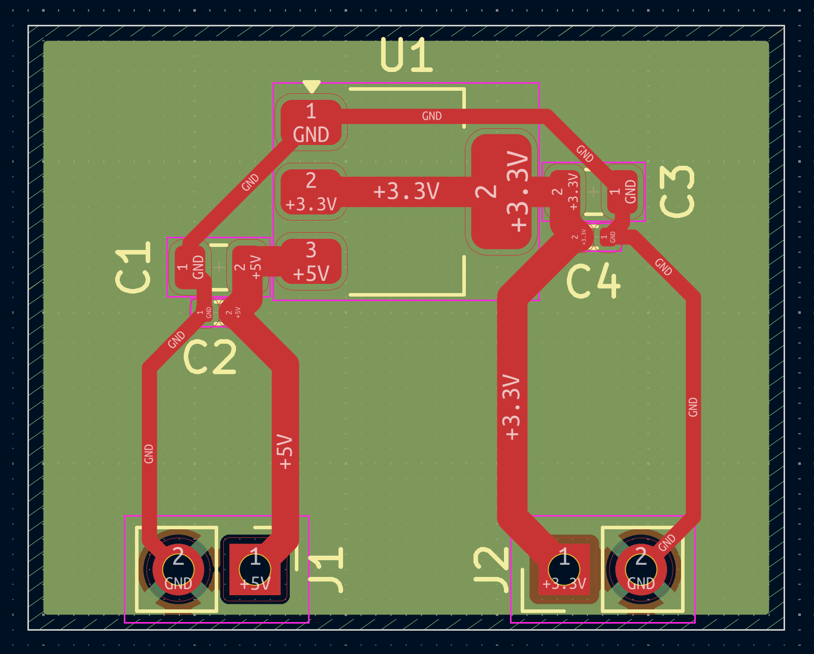

# AMS1117 Power Supply

A 5V-to-3.3V linear regulator board with full input/output decoupling,
built on a 4-layer stackup with dedicated ground and power planes.

## Schematic

## PCB Layout

## Design notes

- **Regulator:** AMS1117-3.3, a fixed 3.3V LDO. Input and output decoupling
  follow the datasheet's recommended pairing — a 10uF bulk capacitor for
  transient current demand alongside a 100nF capacitor for high-frequency
  noise, on both the input and output rails
- **Connectors:** J1 (input) and J2 (output) sit on opposite sides of the
  board, with the regulator in between — keeping the power path visually
  traceable left to right
- **PWR_FLAG:** placed on the +3.3V output rail and on GND, since both are
  externally driven/sourced rather than generated on this sheet, which
  satisfies KiCad's ERC for power rails with no visible source

## Stackup

This board uses a 4-layer stackup:

| Layer | Use |
|-------|-----|
| F.Cu | Component placement, signal/power routing |
| In1.Cu | Dedicated GND plane (solid pour) |
| In2.Cu | Dedicated power plane (solid pour)|
| B.Cu | Unused on this board — all routing fit on F.Cu |

A solid ground plane on an inner layer gives every trace on F.Cu a continuous,
low-impedance return path directly beneath it, which reduces EMI and noise
coupling compared to routing GND as traces on a single layer. For a simple
linear regulator like this, 2 layers would work fine electrically — this
board uses 4 specifically to establish and verify the stackup configuration,
via placement, and inner-layer pour workflow in KiCad.

## Manufacturing

- SMD throughout (SOT-223 regulator, 0805/0402 passives) for compact assembly
- Passed DRC with 0 violations, 0 unconnected nets
- Inner layer fills set to solid (not thermal relief) on small SMD pads