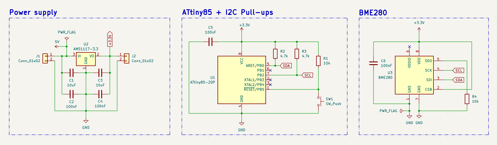
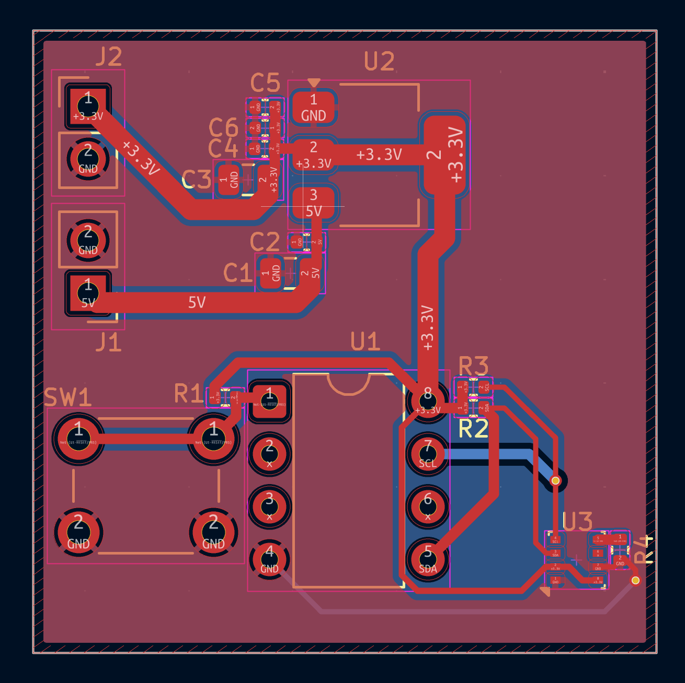

# BME280 I2C Sensor Board

A self-contained environmental sensor board: takes 5V in, regulates it down
to 3.3V onboard, and reads temperature, humidity, and pressure from a BME280
over I2C via an ATtiny85.

## Schematic

## PCB Layout

## Design notes

**Power supply:** an AMS1117-3.3 regulates the 5V input down to 3.3V on board,
with the standard input/output decoupling pair (10uF + 100nF) on each side.
This makes the board self-contained — it only needs a 5V source, not a
pre-regulated 3.3V rail.

**I2C bus:** SDA and SCL run between the ATtiny85 (PB0/PB2) and the BME280,
each pulled up to 3.3V through a 4.7kΩ resistor. I2C uses open-drain
signaling, so the bus relies on these external pull-ups to return the line to
a high state — without them, both lines would float and communication would
fail.

**I2C address selection:** the BME280's SDO pin is tied to GND through a 10kΩ
resistor rather than wired directly, setting the device address to 0x76. A
direct connection works electrically the same way, but the datasheet
recommends a resistor since SDO can act as an output in some modes, and a
hard tie to GND would risk a short if that ever occurred.

**VDDIO:** the BME280 has separate VDD and VDDIO pins for its analog supply
and digital I/O supply. Both are tied to the same 3.3V rail here since the
whole board runs on a single voltage.

**Decoupling:** the ATtiny85, BME280, and AMS1117 each have capacitors placed
close to their respective power pins.

## Layout

- Three-stage left-to-right layout: power input/regulation → ATtiny85 → BME280
- BME280 placed away from the AMS1117 to avoid regulator heat skewing
  temperature readings
- Small SMD/LGA pads (BME280, 0402 passives) use solid zone connections
  rather than thermal relief spokes, since these pads are reflow-soldered in
  production and don't need the heat isolation thermal relief provides for
  hand soldering
- Some routing falls back to the back copper layer where two nets would
  otherwise cross on the front layer

## Manufacturing

- 2-layer board with GND copper pour
- Passed DRC with 0 violations, 0 unconnected nets