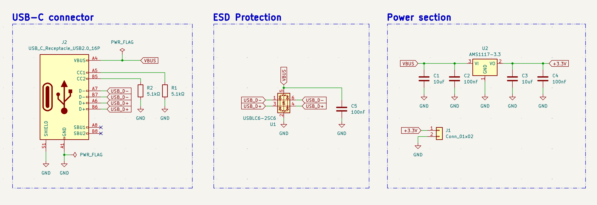
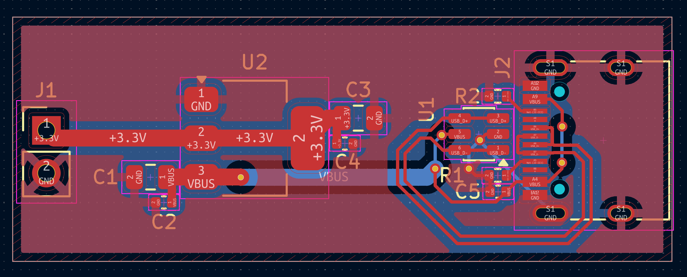

# USB-C Power Board

A USB-C input stage with ESD protection and onboard 3.3V regulation —
a complete, standards-compliant power entry point for a USB-powered design.

## Schematic

## PCB Layout

## Design notes

**USB-C power detection:** CC1 and CC2 are each pulled down to GND through a
5.1kΩ resistor. This is the minimum circuit required for a USB-C device to be
recognized as a power sink and offered 5V — without these pull-downs, a
USB-C source has no way to detect that something is plugged in.

**ESD protection:** a USBLC6-2SC6 sits within a few millimeters of the
connector, ahead of every other component on the board. Its job is to clamp
any electrostatic discharge spike before it can travel further into the
circuit — placing it anywhere else would leave the path between the
connector and the IC itself unprotected.

**Differential pair routing:** D+ and D- are routed as a matched pair —
equal length, equal width (0.2mm), routed together with no vias — to
maintain the 90Ω differential impedance USB 2.0 requires. Mismatched lengths
or widths here can cause signal reflections and data errors at the receiver.

**Power regulation:** VBUS (5V from the USB-C connector) feeds an AMS1117-3.3
to produce a regulated 3.3V output, available on a separate 2-pin connector
for downstream use.

## Layout

- ESD protection IC, CC pull-downs, and their decoupling cap are clustered
  tightly around the USB-C connector
- D+/D- routed as a matched differential pair directly from the connector to
  the ESD IC, with no other signals routed nearby to avoid coupling
- Power regulation stage placed downstream, since it carries no
  high-speed/impedance-sensitive signals and has more routing flexibility

## Manufacturing

- 2-layer board with GND copper pour
- Passed DRC with 0 violations, 0 unconnected nets
