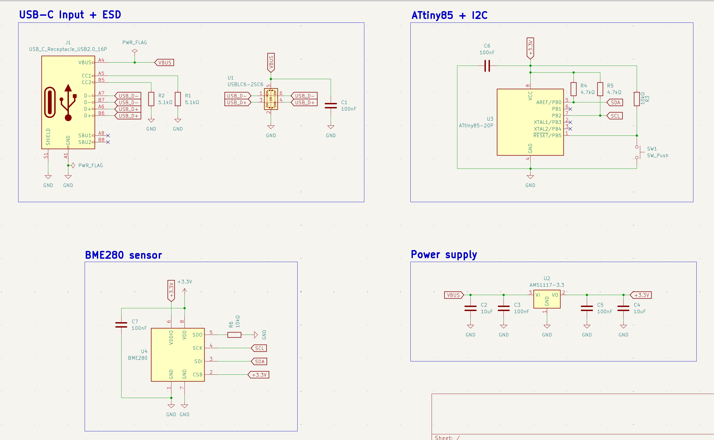
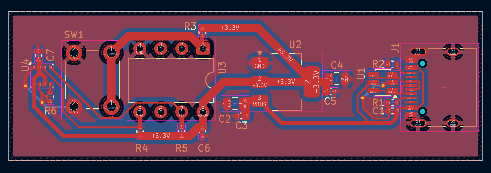

# IoT Environmental Monitor

A complete, USB-C powered environmental sensor system: USB-C input with ESD
protection, onboard 3.3V regulation, an ATtiny85 microcontroller, and a
BME280 sensor reading temperature, humidity, and pressure over I2C. 

## Schematic

## PCB Layout

## Design notes

This board integrates four functional stages into one system:

**USB-C input + ESD:** the connector's CC1/CC2 pins are each pulled to GND
through a 5.1kΩ resistor, the minimum circuit needed for the board to be
recognized as a power sink and offered 5V. A USBLC6-2SC6 sits within a few
millimeters of the connector, clamping any electrostatic discharge spike
before it reaches the rest of the circuit. D+/D- run as a length- and
width-matched pair from the connector to the ESD IC.

**Power supply:** an AMS1117-3.3 regulates the incoming VBUS (5V) down to
3.3V, with standard input/output decoupling (10uF + 100nF on each side).

**ATtiny85 + I2C:** the standard MCU support circuit — 100nF decoupling, a
10kΩ RESET pull-up with a manual reset button, and 4.7kΩ pull-ups on the I2C
bus (SDA/SCL).

**BME280 sensor:** SDO is tied to GND through a 10kΩ resistor (setting the
I2C address to 0x76, per the datasheet's recommendation over a direct tie),
CSB is held high to select I2C mode over SPI, and VDD/VDDIO share the 3.3V
rail.

This is the same sensor circuit as the [BME280 I2C Sensor
Board](../04-bme280-i2c-sensor), with one key difference: that board only
accepts a 5V input on a generic 2-pin connector, while this board adds a full
USB-C input stage with CC detection and ESD protection — the difference
between a bench prototype and a board that could plug into any USB charger
or computer port.

## Layout

- Left-to-right signal flow: USB-C input → power regulation → ATtiny85 → BME280
- ESD protection IC and CC pull-downs clustered tightly around the USB-C
  connector
- D+/D- routed as a matched differential pair with no vias
- BME280 placed away from the regulator to avoid heat affecting readings
- Rectangular board outline sized to fit components with margin, keeping the
  board panelization-friendly (straight edges, no cutouts)

## Manufacturing

- 2-layer board, GND copper pour on the front copper layer
- Passed DRC with 0 violations, 0 unconnected nets
